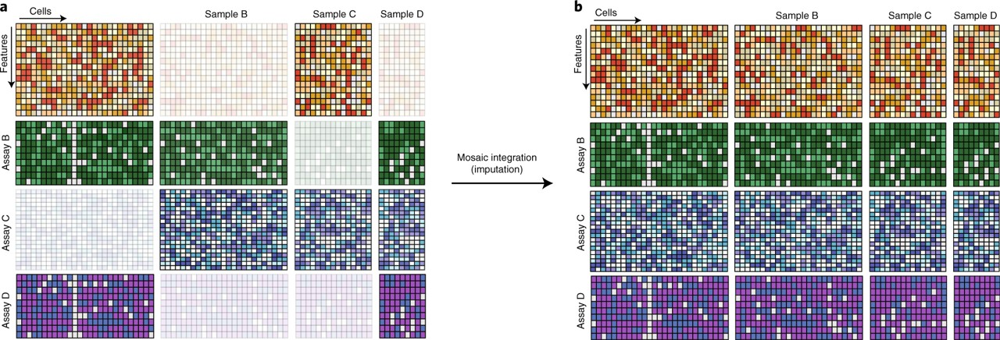

Tutorials
=========

For each task, we provide two to three examples detailing SpaMosaic's workflow, 
including preprocessing, input preparation, training, inference, clustering, and visualization (evaluation).

The figures below are cited from `Richard et. al, Nature Biotechnology <https://www.nature.com/articles/s41587-021-00895-7>`_.

**Integration**

.. container:: tutorial-grid

   .. list-table::
      :widths: 33 33 33
      :header-rows: 0
      :align: center

      * - .. image:: ../_static/horizontal.jpg
            :width: 120px
            :align: center

          :doc:`Horizontal Integration <integration/horizontal/index>`

        - .. image:: ../_static/vertical.jpg
            :width: 120px
            :align: center

          :doc:`Vertical Integration <integration/vertical/index>`

        - .. image:: ../_static/mosaic.jpg
            :width: 120px
            :align: center

          :doc:`Mosaic Integration <integration/mosaic/index>`

**Imputation**

   :doc:`Imputation <imputation/index>`

.. toctree::
   :maxdepth: 3
   :caption: Tutorials
   :hidden:
   
   integration/horizontal/index
   integration/vertical/index
   integration/mosaic/index
   imputation/index