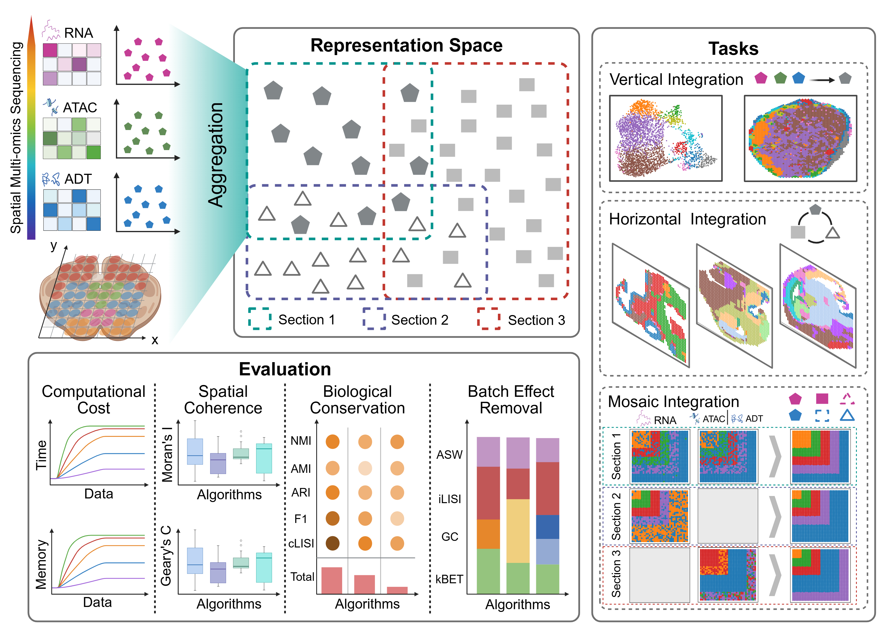

# SMOBench: Spatial Multi-Omics Benchmarking Framework

A comprehensive benchmarking framework for spatial multi-omics integration methods.

## Framework


## Dataset
The dataset can be found in https://drive.google.com/file/d/1XPmGicNOeaKjMnMGqvMPD3HLIBy8ostX/view?usp=drive_link

## Quick Start

### Environment Setup
```bash
conda env create -f environment.yml
conda activate smobench
```

### Running Methods
**IMPORTANT**: All scripts must be run from the SMOBench root directory.

#### SpatialGlue
```bash
# Single dataset
python Scripts/integration/SpatialGlue/run_SpatialGlue.py \
  --data_type 10x \
  --RNA_path Dataset/withGT/RNA_ADT/Human_Lymph_Nodes/A1/adata_RNA.h5ad \
  --ADT_path Dataset/withGT/RNA_ADT/Human_Lymph_Nodes/A1/adata_ADT.h5ad \
  --save_path Results/adata/SpatialGlue/HLN/A1/SpatialGlue_HLN_A1.h5ad \
  --method SpatialGlue \
  --dataset Human_Lymph_Nodes/A1 \
  --cluster_nums 6

# Batch processing
bash Scripts/integration/SpatialGlue/run.sh
```

#### SpaMV
```bash
# Single dataset
python Scripts/integration/SpaMV/run_SpaMV.py \
  --RNA_path Dataset/withGT/RNA_ADT/Human_Tonsils/S1/adata_RNA.h5ad \
  --ADT_path Dataset/withGT/RNA_ADT/Human_Tonsils/S1/adata_ADT.h5ad \
  --save_path Results/adata/SpaMV/HT/S1/SpaMV_HT_S1.h5ad \
  --method SpaMV \
  --dataset Human_Tonsils/S1 \
  --cluster_nums 6

# Batch processing
bash Scripts/integration/SpaMV/run.sh
```

## Project Structure

```
SMOBench-CLEAN/
├── Dataset/                    # Organized datasets
│   ├── withGT/                # Datasets with ground truth
│   └── woGT/                  # Datasets without ground truth
├── Methods/                   # Integration methods
│   ├── SpatialGlue/          # Graph-based integration
│   ├── SpaMV/                # Variational integration
│   ├── SpaMosaic/            # Mosaic integration
│   ├── PRAGA/                # Adversarial integration
│   └── COSMOS/               # Multi-modal integration
├── Scripts/                  # Execution scripts
│   ├── integration/          # Method execution scripts
│   ├── evaluation/           # Evaluation and metrics
│   └── visualization/        # Plotting and analysis
├── Utils/                    # Common utilities
├── Results/                  # Experimental outputs
│   ├── adata/                # Processed results
│   └── plot/                 # Visualizations
└── docs/                     # Documentation
```

## Supported Methods

- **SpatialGlue**: Graph-based spatial multi-omics integration
- **SpaMV**: Spatial Multi-omics Variational integration
- **SpaMosaic**: Mosaic integration method
- **PRAGA**: Adversarial integration approach
- **COSMOS**: Multi-modal integration framework

## Data Types

- **RNA+ADT**: Transcriptome + Proteome integration
- **RNA+ATAC**: Transcriptome + Epigenome integration

## Clustering Methods

- **mclust**: Gaussian mixture model clustering
- **leiden**: Community detection clustering
- **louvain**: Modularity optimization clustering
- **kmeans**: K-means clustering
