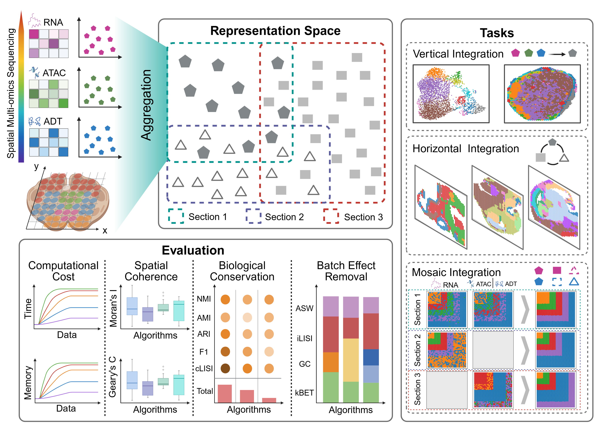

## Framework Overview

**Integration Tasks:**
- **Vertical Integration**: Cross-modality integration within the same sample (RNA+ADT, RNA+ATAC)
- **Horizontal Integration**: Cross-sample integration with batch effect removal
- **Mosaic Integration**: Mixed modality and batch integration

**Evaluation Dimensions:**
- **Spatial Coherence (SC)**: Spatial clustering quality
- **Biological Conservation (BioC)**: Clustering accuracy and biological validity
- **Batch Effect Removal (BER)**: Cross-batch mixing metrics (horizontal/mosaic only)

**Methods Evaluated:**
CANDIES, COSMOS, PRAGA, PRESENT, SpaMV, SpaMosaic, SpatialGlue, SpaMultiVAE, SpaFusion, SMOPCA

**Clustering Methods:**
Leiden, Louvain, K-means, Mclust

## Project Structure

- **Dataset/**: Multi-modal spatial omics datasets (withGT/woGT)
- **Methods/**: Integration method implementations
- **Scripts/**: Execution workflows for integration and evaluation
- **Eval/**: Evaluation framework and metrics calculation
- **Results/**: Integration outputs and evaluation results
- **Utils/**: Shared utilities and clustering interface

## Quick Start

1. **Integration**: Run methods using scripts in `Scripts/`
2. **Evaluation**: Use evaluation scripts in `Eval/`
3. **Results**: Find processed outputs in `Results/`

## Data Access

- **Datasets**: https://drive.google.com/drive/u/1/folders/11zYh27BK9QuqU7zObApCYSzSEMqHS0G6
- **Integration Results**: Available in AnnData format at the same link

